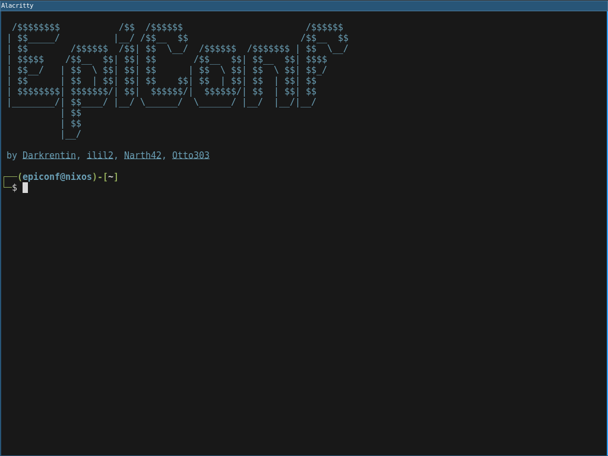
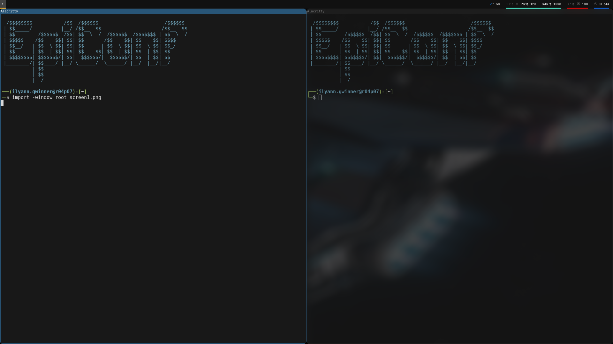
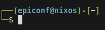

# EpiConf

**EpiConf** is a complete configuration pack designed for EPITA students.  
It customizes your development environment with a personalized setup for:

- [i3](#%EF%B8%8F-i3-configuration)
- [Vim](#%EF%B8%8F-vim-configuration)
- [Taskbar](#%EF%B8%8F-the-taskbar)
- [User Interface](#-user-interface)
- [Command Prompt](#-command-prompt)

---

## 📦 Installation

> ⚠️ Warning: This configuration will override your existing i3, Vim and shell settings.  
> Make sure to back up your current configuration before installing.

Run this in your shell:

```bash
curl -L epiconf.getfdn.com | sh -s
````

During setup, you will be asked to create a password.  
This password is **not** your system password – it is only used to secure your `.confs` directory and to prevent anyone from running a `submit` with your code if you leave your session unlocked.  
Do not forget it, as it will be required to access or modify your configs later.  

> 🔐 Security note: **Never forget to i3lock!**

You can also open this documentation anytime with:

```bash
epiconf
````

You can update the config with:

```bash
update-conf
````

And if you want to delete Epiconf and get back to the [default config of epita](https://github.com/epita/epita-default-confs):

```bash
reset-conf
````

> reset the config also remove Epiconf settings, wallpapers and startup script.

---

## Epiconf Settings

you can change the main settings of the config in ````.confs/epiconf/config.ini````

## 🖥️ i3 Configuration

Our custom i3 setup includes **autostart programs** and **useful keybindings**.

### Automatic startup

* Opens a terminal and Firefox on login
* Changes wallpaper every 5 minutes
* automatically start the scripts located in ````.confs/epiconf/start_script/````

> 🖼️ You can change the wallapaper in ````.confs/config/wallpapers/````
> ⚙️ All startup scripts must be Bash files with execution permissions already set.

### Shortcuts

* `Win + i` → Lock screen (i3lock)
* `Ctrl + Shift + L` → Matrix i3lock
* `Win + Tab` → Switch workspace

---

## ✍️ Vim Configuration

We have enhanced Vim with useful plugins and shortcuts.

### Plugins

* [`vim-airline`](https://github.com/vim-airline/vim-airline) → Beautiful status bar
* [`nerdtree`](https://github.com/preservim/nerdtree) → File tree explorer
* [`syntastic`](https://github.com/vim-syntastic/syntastic) → Syntax checking

### Shortcuts

* `Ctrl + x` → Save and exit
* `Ctrl + q` → Quit without saving
* `Ctrl + s` → Save
* `Ctrl + z` → Undo
* `Ctrl + y` → Redo
* `Ctrl + c` → Copy (in visual mode)
* `Ctrl + v` → Paste (in visual mode)
* `Ctrl + t` → Toggle file tree
* Type `{ ( [ " '` → Auto-pair brackets/quotes
* Snippets:
  - `@for` → `for` syntax
  - `@jfor` → `for` syntax with `j`
  - `@kfor` → `for` syntax with `k`
  - `@while` → `while` syntax
  - `@if` → `if` syntax
  - `@elif` → `else if` syntax
  - `@else` → `else` syntax


---

## 🛠️ The Taskbar

A new **top taskbar** displays:

* Current workspace
* Clock
* AFS storage usage
* RAM usage
* CPU usage

---

## 🎨 User Interface

* Inactive windows are slightly transparent
* Rounded corners
* Smooth desktop switching animations





---

## 🐚 Command Prompt

Our shell prompt is inspired by Kali Linux and shows:

* Username
* Current directory
* Git branch & changes



### Extra commands

* `gtg` → Create `.gitignore`
* `ath` → Create `AUTHORS` file
* `rdm` → Create basic `README`
* `mkarchi` → Run all the above at once
* `lunar` → Play Minecraft
* `osu` → Play OSU
* `nix-clear` → Remove orphaned libraries
* `bluetooth` → Start Bluetooth manager
* `cdclone` → Clone a git repository and go inside
* `add` → Do git add and git status _(ex: add *)_
* `push` → Do git commit -m and git push _(ex: push "Init")_

> Access to `.confs` is password protected for extra security.

---

## 📜 License

MIT License – free to use and modify.
