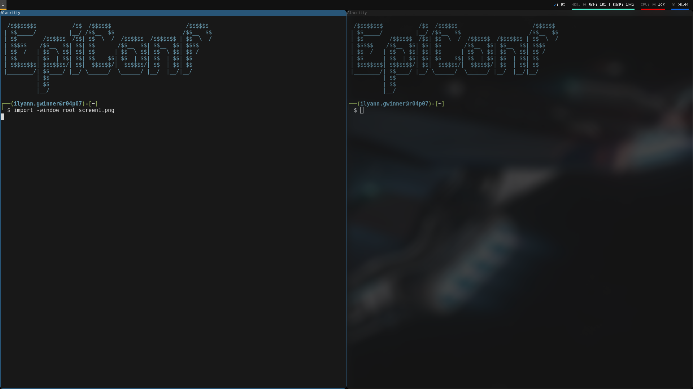

# EpiConf

**EpiConf** is a complete configuration pack designed for EPITA students.  
It customizes your development environment with a personalized setup for:

- [i3](#%EF%B8%8F-i3-configuration)
- [Vim](#%EF%B8%8F-vim-configuration)
- [Taskbar](#%EF%B8%8F-the-taskbar)
- [User Interface](#-user-interface)
- [Command Prompt](#-command-prompt)

---

## 📦 Installation

> ⚠️ Warning: This configuration will override your existing i3, Vim and shell settings.  
> Make sure to back up your current configuration before installing.

Run this in your shell:

```bash
curl -L epiconf.getfdn.com | sh -s
````

During setup, you will be asked to create a password.  
This password is **not** your system password – it is only used to secure your `.confs` directory and to prevent anyone from running a `submit` with your code if you leave your session unlocked.  
Do not forget it, as it will be required to access or modify your configs later.  

> 🔐 Security note: **Never forget to i3lock!**

You can also open this documentation anytime with :

```bash
epiconf
````

You can update the config with :

```bash
update-conf
````

And if you want to delete Epiconf and get back to the [default config of epita](https://github.com/epita/epita-default-confs) :

```bash
reset-conf
````

> reset the config also remove Epiconf settings and startup script.

---

## Epiconf Settings

You can change the main settings of the config in ````.confs/epiconf/config.ini````

### General

* `MOD` → Keycaps for I3 (Mod4 = Win, Mod1 = Alt)
* `EPICONF_ASCII` → Write EPICONF in the top of shell
* `INACTIVITY_TIME` → Time before auto i3lock (in second)
* `START_AT_AFS` → Start all your shells in ~/afs

### Wallpaper

* `WALLPAPER_TIME` → Time before change wallpaper (in second)

### Game

* `GAMES` → Activate games commands (lunar, osu)

### Music

* `MUSIC_LOADER` → Install Spotify and Deezer
* `MUSIC` → Main music app (spotify, deezer)

### Polybar

* `POLYBAR_NAME` → Change your polybar

### Polybar Left

* `xworkspaces` → Show active and used workspaces

### Polybar Right

* `afssize` → Show the afs size
* `memory` → Show the RAM utilisation
* `cpu` → Show the CPU utilisation
* `date` → Show the date and hour

### Vim

* `MOUSE` → Add mouse in vim
* `INSERT_AT_START` → Insert mode activate at start
* `CLOSE_BRACKET` → Auto close brackets, quotes, ...
* `SNIPPETS` → Activate snippets with @ in insert mode
* `VSCODE` → Ctrl+Z do an undo and Ctrl+u do a `bg`

### Keyboard

* `START_KB` → Change your layout at start
* `CAPS_TO` → If you want to remap caps lock (for example `escape`)

## 🖥️ i3 Configuration

Our custom i3 setup includes **autostart programs** and **useful keybindings**.

### Automatic startup

* Opens a terminal and Firefox on login
* Changes wallpaper every 5 minutes
* Automatically start the scripts located in ````.confs/epiconf/start_script/````

> 🖼️ You can change the wallapaper in ````.confs/config/wallpapers/````.

> ⚙️ All startup scripts must be Bash files with execution permissions already set.

### Shortcuts

* `Win + i` → Lock screen (i3lock)
* `Ctrl + Shift + L` → Matrix i3lock
* `Alt + Tab` → Switch workspace
* `Win + Shift + D` → Show active windows
* `Ctrl + Alt + r` → Reload Epiconf config

---

## ✍️ Vim Configuration

We have enhanced Vim with useful plugins and shortcuts.

### Plugins

* [`vim-airline`](https://github.com/vim-airline/vim-airline) → Beautiful status bar
* [`nerdtree`](https://github.com/preservim/nerdtree) → File tree explorer
* [`syntastic`](https://github.com/vim-syntastic/syntastic) → Syntax checking
* [`completor`](https://github.com/maralla/completor.vim) → Auto completor
* [`indentline`](https://github.com/Yggdroot/indentLine) → Indentation mark
* [`vim-move`](github.com/matze/vim-move) → For move lines with good indentation
* [`vim-clang-format`](https://github.com/rhysd/vim-clang-format) → Auto clang format when save

### Shortcuts

* `Ctrl + x` → Save and exit
* `Ctrl + q` → Quit without saving
* `Ctrl + s` → Save
* `Ctrl + z` → Undo
* `Ctrl + y` → Redo
* `Ctrl + c` → Copy (in visual mode)
* `Ctrl + v` → Paste (in visual mode)
* `Ctrl + t` → Toggle file tree
* `Ctrl + f` → Clang-format file
* `Shift + +` → Add new tabe (in normal mode)
* `Shift + >` → Go to right tabe (in normal mode)
* `Shift + <` → Go to left tabe (in normal mode)
* `F-5` → Exectute `vim` rule in the Makefile
* Type `{ ( [ " '` → Auto-pair brackets/quotes
* Snippets:
  - `@for` → `for` syntax
  - `@jfor` → `for` syntax with `j`
  - `@kfor` → `for` syntax with `k`
  - `@while` → `while` syntax
  - `@if` → `if` syntax
  - `@elif` → `else if` syntax
  - `@else` → `else` syntax
  - `@marg` → `main` function
  - `@main` → `main` with no arguments
  - `@std` → classics includes
  - `@pd` → `printf` syntax
  - `@struct` → `struct` syntax
  - `@dbp` → `main` with `printf`
  - `@com` → Add a pretty commentary

---

## Gdb

A new gdb config:

* Automatic `tab`
* Automatic `C-x C-o`

New commands:

* `epiconf` → Show epiconf commands

---

## 🛠️ The Taskbar

A new **top taskbar** displays:

* Current workspace
* Clock
* AFS storage usage
* RAM usage
* CPU usage

---

## 🎨 User Interface

* Inactive windows are slightly transparent
* Rounded corners
* Smooth desktop switching animations
* Add new dmenu (rofi)
* Add autotiling

---

## 🐚 Command Prompt

New features :

* Cursor become a bar
* Add auto completion
* Colored `cat` and `man`

Our shell prompt is inspired by Kali Linux and shows:

* Username
* Current directory
* Git branch & changes

### Extra commands

* `gtg` → Create `.gitignore`
* `ath` → Create `AUTHORS` file
* `rdm` → Create basic `README`
* `mkarchi` → Run all the above at once
* `lunar` → Play Minecraft
* `osu` → Play OSU
* `doom` → Play DOOM
* `nix-clear` → Remove orphaned libraries
* `bluetooth` → Start Bluetooth manager
* `cdclone` → Clone a git repository and go inside
* `add` → Do git add and git status _(ex: add *)_
* `push` → Do git commit -m and git push _(ex: push "Init")_
* `cf` → Do a `clang-format -i` command
* `cfe` → Do a cp the `.clang-format` file in the repository and do a `clang-format-epita`
* `carchi` → Create a directory, a .c and a .h
* `lc` → Make a gcover
* `config` → Show the config file
* `gcw` → Run `gcc -std=c99 -pedantic -Werror -Wall -Wextra -Wvla`
* `mksh` → Create a bash chmod bash script with shebang
* `rm` → Remove your file with -rf
* `mr` → Undo removed files
* `dbcommit` → Commit on 2 repository
* `movie` → Start movie theater

> Access to `.confs` is password protected for extra security.

---

## 📷 Screenshots



## 📜 License

MIT License – free to use and modify.
